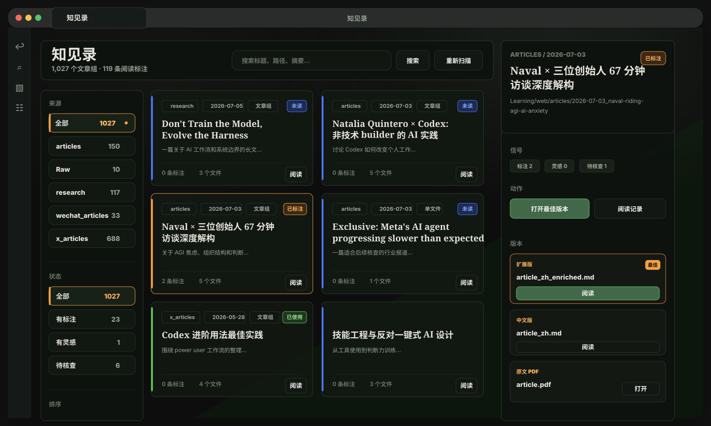
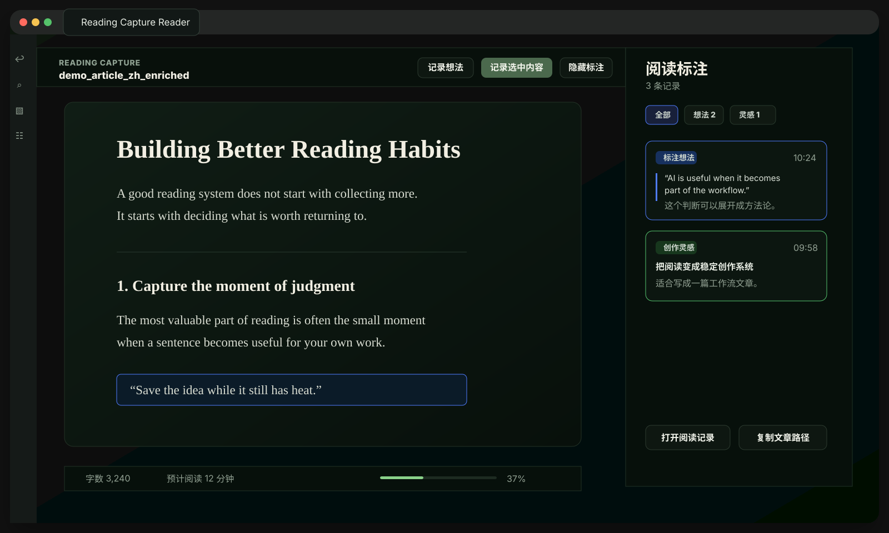
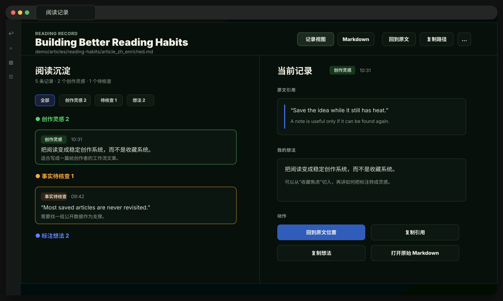
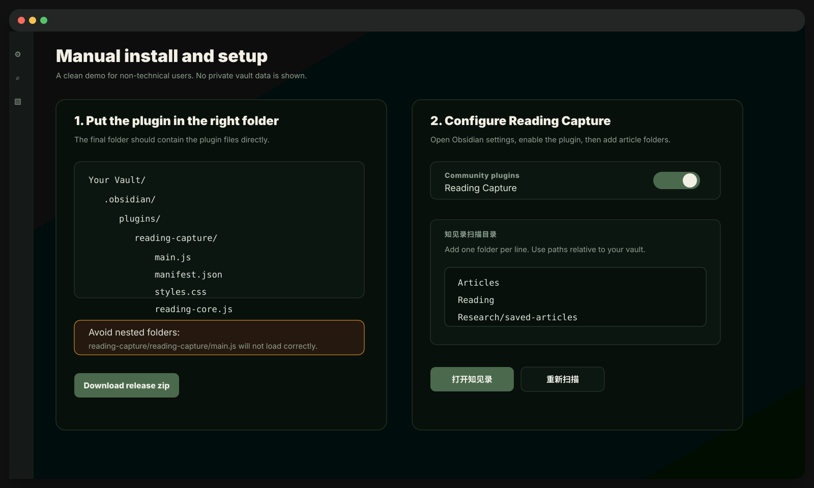

# Reading Capture

简体中文 | [English](README.md)

Reading Capture 是一个 Obsidian 插件，适合经常保存文章、做深度阅读、写笔记、积累创作灵感和素材的人使用。

它会在 Obsidian 里提供一个更适合阅读的界面，一个用来浏览文章的 `知见录`，以及一个专门查看阅读标注和想法的阅读记录页。

当前版本：`0.4.3`

## 这个插件能做什么

- 在 `知见录` 里集中浏览你保存过的文章。
- 用更安静的阅读视图打开 Markdown 文章。
- 如果文章目录下有 PDF，也可以从插件里打开 PDF。
- 选中文字后保存标注和想法，同时尽量不把原文弄得很乱。
- 保存三类阅读记录：
  - 普通想法
  - 创作灵感
  - 事实待核查
- 在单独的阅读记录页面里查看一篇文章的所有记录。
- 从某一条记录跳回原文对应位置，能定位时会自动定位。
- 复制文章路径、原文引用和自己的想法，方便后续写作使用。

## 界面预览

下面是按当前界面布局重绘的匿名 demo 图，用来展示插件的真实使用流程，不包含真实用户数据。

### 知见录

集中浏览文章、阅读状态、文件版本，以及已有标注和创作灵感。



### 阅读器和标注

在更安静的阅读界面里保存标注、想法、创作灵感和待核查事实。



### 阅读记录

把一篇文章里的所有记录整理成可浏览、可复制、可回到原文的位置。



### 安装和设置

手动安装时，插件目录里应该直接看到 `main.js`、`manifest.json`、`styles.css` 和 `reading-core.js`。



## 安装方式

这个插件目前主要通过 GitHub 手动安装，还没有发布到 Obsidian 官方社区插件市场。

1. 从 GitHub Release 下载最新版 `reading-capture.zip`。
2. 解压这个文件。
3. 把解压出来的 `reading-capture` 文件夹放到你的 Obsidian 仓库里：

```text
你的 Obsidian 仓库/
└── .obsidian/
    └── plugins/
        └── reading-capture/
            ├── main.js
            ├── reading-core.js
            ├── manifest.json
            └── styles.css
```

4. 打开 Obsidian。
5. 进入 `设置` -> `第三方插件`。
6. 确认第三方插件已经开启。
7. 找到并启用 `Reading Capture`。

如果你复制插件文件时 Obsidian 已经打开，请重启 Obsidian，或者先关闭再重新启用这个插件。

## 更新插件

手动安装的插件更新方式也很简单：

1. 下载最新版 `reading-capture.zip`。
2. 解压。
3. 用新的插件文件覆盖旧目录里的文件：

```text
你的 Obsidian 仓库/.obsidian/plugins/reading-capture/
```

4. 重启 Obsidian，或者关闭并重新启用 Reading Capture。

你的阅读记录会作为 Markdown 文件保存在 Obsidian 仓库里。正常覆盖插件文件不会删除这些阅读记录。

## 手动安装常见问题

### 插件列表里看不到 Reading Capture

请先检查文件夹位置。最终目录应该是：

```text
你的 Obsidian 仓库/.obsidian/plugins/reading-capture/
```

这个目录里应该直接看到 `main.js`、`manifest.json`、`styles.css` 和 `reading-core.js`。

如果你看到的是下面这种结构，就说明多套了一层文件夹：

```text
reading-capture/
└── reading-capture/
    ├── main.js
    ├── manifest.json
    └── styles.css
```

把里面那层 `reading-capture` 移到 `.obsidian/plugins/` 下面即可。

### 下载 GitHub 源码后插件不能用

请下载 Release 里的 `reading-capture.zip`，不要下载 GitHub 页面上的 `Source code.zip`。源码包不是给普通安装用的，里面缺少整理好的插件结构。

### 更新后还是旧界面

重启 Obsidian，或者在 `设置` -> `第三方插件` 里关闭再重新开启 Reading Capture。

## 第一次使用

启用插件后，先进入 `设置` -> `Reading Capture`。

最重要的是配置 `知见录扫描目录`。这里要填写你平时保存文章的文件夹。

例如：

```text
Articles
Reading
Saved Articles
Research Notes
```

这里填写的是相对于 Obsidian 仓库的路径。

比如文章实际放在：

```text
你的 Obsidian 仓库/Saved Articles/example/article.md
```

那你可以填写：

```text
Saved Articles
```

设置好后，在 Obsidian 命令面板里运行：

```text
Reading Capture: 打开知见录
```

## 主要配置说明

### 阅读笔记根目录

这里决定 Reading Capture 把阅读记录保存到哪里。

默认是：

```text
Reading Capture/notes
```

一般不需要修改。除非你希望把阅读记录放在自己的某个固定目录里。

### 知见录扫描目录

这里填写你希望插件扫描的文章目录。

每行填写一个目录。插件会在这些目录里寻找 Markdown 和 PDF 文件。

### 知见录排除目录

这里填写不希望插件扫描的目录。

插件默认会跳过阅读记录目录和 Obsidian 自己的 `.obsidian` 目录。如果你有归档、草稿、临时文件夹，也可以加到这里。

## 日常怎么用

### 打开知见录

在 Obsidian 命令面板里运行：

```text
Reading Capture: 打开知见录
```

`知见录` 会展示你的文章组、阅读状态、已有文件版本，以及这篇文章有没有标注、创作灵感和待核查内容。

### 打开文章

在 `知见录` 里点击 `阅读` 或 `打开最佳版本`。

如果同一篇文章有多个版本，插件会尽量选择更适合阅读的 Markdown 版本。如果只有一个 Markdown 文件，也可以作为单篇文章打开。

### 保存标注或想法

在阅读器里：

1. 选中一段文字。
2. 右键，或使用 Reading Capture 的命令。
3. 选择记录类型，并写下你的想法。

如果你只是想记录当前灵感，不想选中文字，也可以使用 `记录当前想法`。

### 保存创作灵感

当你觉得某段内容或某个想法以后可能能继续研究、写成文章，或变成后续作品，可以使用：

```text
Reading Capture: 加入创作灵感
```

### 保存事实待核查

当你看到一个重要但还需要确认的信息，可以使用：

```text
Reading Capture: 加入事实待核查
```

### 查看阅读记录

可以从 `知见录` 的右侧详情，或者从阅读器右侧栏点击 `阅读记录`。

阅读记录页可以帮你：

- 按类型浏览一篇文章里的所有记录。
- 查看原文引用和你的想法。
- 在整理后的记录视图和原始 Markdown 之间切换。
- 回到原文对应位置。
- 复制引用、想法或文章路径。

## 常用命令

打开 Obsidian 命令面板，搜索 `Reading Capture`。

常用命令包括：

- `Reading Capture: 打开知见录`
- `Reading Capture: 打开创作灵感`
- `Reading Capture: 打开阅读器视图`
- `Reading Capture: 标注选中文本并记录想法`
- `Reading Capture: 快速高亮选中文本`
- `Reading Capture: 记录当前想法`
- `Reading Capture: 加入创作灵感`
- `Reading Capture: 加入事实待核查`
- `Reading Capture: 打开当前文件的阅读记录`
- `Reading Capture: 标记当前阅读为已完成`
- `Reading Capture: 重建阅读索引`

## 使用注意事项

- Reading Capture 主要在你的 Obsidian 仓库内部工作。
- 插件本身不会把你的文章或笔记发送到在线服务。
- 这个插件本身不内置 AI 选题功能，也不需要额外安装 Topic Miner 之类的自动化工具。“创作灵感”只来自你在阅读时手动保存的记录。如果你后续有自己的 AI 自动化流程，也可以读取这些结构化的 Markdown 阅读记录。
- “回到原文位置”依赖原文中还能找到当初标注的文字。如果原文被大幅修改，可能只能打开原文，不能精确定位。
- 如果你移动了文章文件，可能需要运行 `重建阅读索引`，或者手动调整相关路径。

## 许可证

Apache License 2.0。详见 [LICENSE](LICENSE)。
